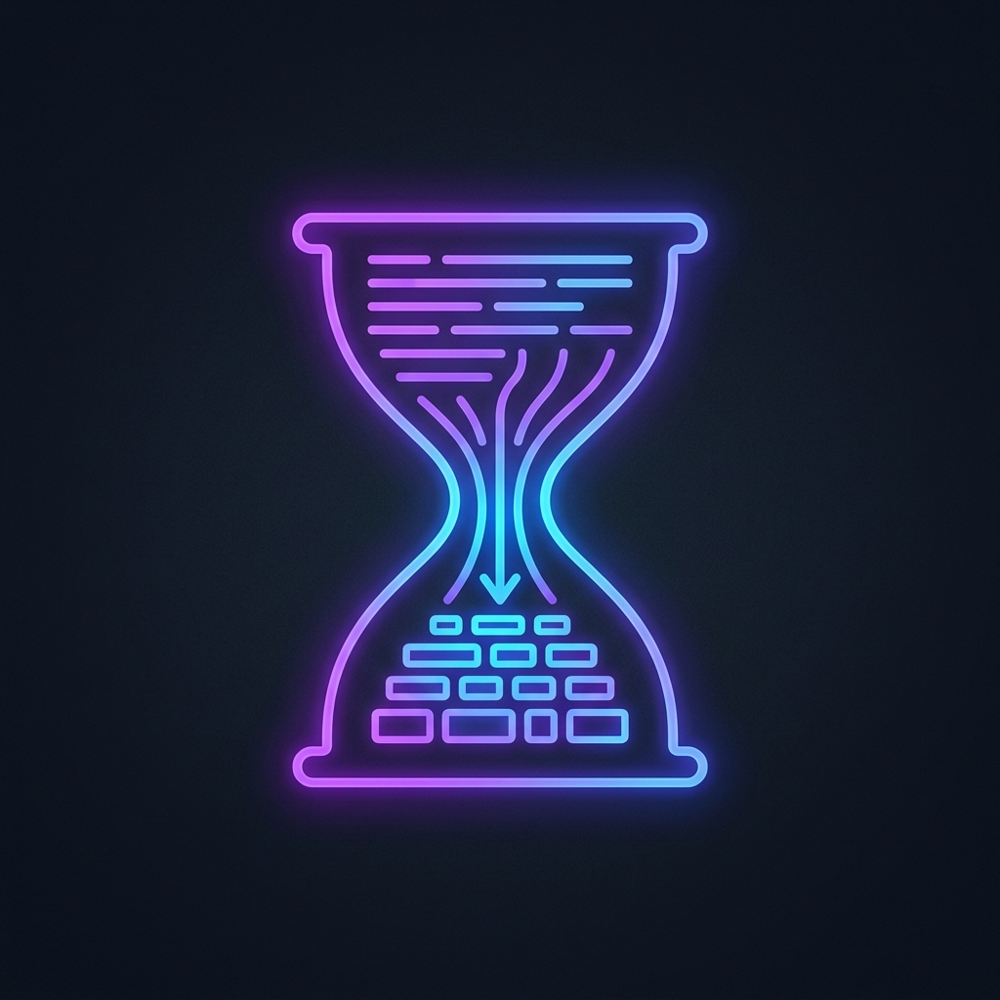
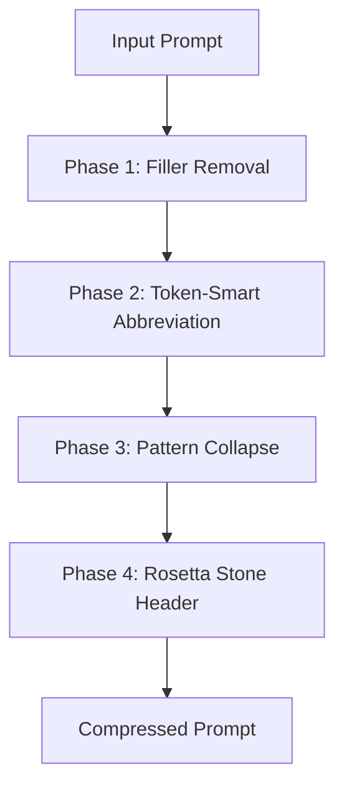

<div align="center">
  
  <h1>◈ Prompty (TokenShrink)</h1>
  <p><strong>Same AI, fewer tokens. Save up to 35% on LLM bills — no quality loss.</strong></p>

  [](https://github.com/learnerabhinavdwivedi-droid/prompty)
  [](#)
  [](LICENSE)
  [](https://github.com/learnerabhinavdwivedi-droid)

  <br />
  <a href="https://promptyy-eta.vercel.app/"><strong>Explore the Live App</strong></a> · 
  <a href="#">Docs</a> · 
  <a href="#">AI Providers</a> · 
  <a href="#">npm</a>
</div>

---

> [!NOTE]  
> **What is Prompty?**  
> I'm **Abhinav Dwivedi**, and I built this because I was getting destroyed by LLM token costs on my side projects. Turns out a huge portion of tokens are just filler — "in order to", "it is important to note", "due to the fact that" — stuff no LLM needs to work well.

I spent a few weekends building a proper compression engine. Not vibes-based — every single substitution is verified against the actual BPE tokenizer used by GPT-4, Claude, and Gemini. If a swap doesn't genuinely save tokens, it doesn't get included.

The result: **12–15% real savings** on verbose prompts, zero false positives, under 20ms processing time, and a self-describing Rosetta Stone header so the model always understands the compressed output.

## 🚀 What it actually does

```
Input:  "In order to initialize the application, it is important to first 
         load the configuration files before proceeding with the setup."

Output: "[DECODE: config=configuration, init=initialize]
         To init the app, load config files before setup."

Tokens: 31 → 19  (38.7% saved)
```

> [!TIP]
> The header at the top tells the model exactly how to decode abbreviations. It's learned this trick from how code comments work — models are really good at following embedded instructions. The net token count still ends up lower than the original even with the header included.

---

## ✨ Features

### ⚙️ Core Compression Engine
- **4-phase pipeline**: filler removal → token-smart abbreviation → pattern collapse → Rosetta header
- **BPE-calibrated**: every substitution tested against `cl100k_base` (GPT-4/Claude/Gemini)
- **Zero false positives**: skips short prompts (<30 words) where the header overhead would lose tokens
- **Blazing Fast**: Under 20ms — pure JS, no external API calls, runs at the edge.

### 🌐 Platform
- **Web app**: Compress directly in the browser at [promptyy-eta.vercel.app](https://promptyy-eta.vercel.app/)
- **REST API**: `POST /api/compress` — zero-log, works with any language
- **Node.js SDK**: `npm install prompty` — drop into existing pipelines in 2 lines
- **VS Code extension**: compress prompts directly from the editor
- **Auth**: GitHub + Google OAuth + email, powered by NextAuth v5 + Neon Postgres

### 🔒 Privacy
- Prompts processed in-memory and **never stored**.
- Optional TEE deployment via Phala/dstack for cryptographic proof.

---

## 📊 Benchmarks (real, `cl100k_base` verified)

| Prompt Type | Original | Compressed | Saved |
| :--- | :---: | :---: | :---: |
| Developer assistant (verbose) | 408 tok | 349 tok | **14.5%** |
| Code review pipeline | 210 tok | 183 tok | **12.9%** |
| Medical/clinical records | 151 tok | 134 tok | **11.3%** |
| Business requirements brief | 143 tok | 121 tok | **15.4%** |
| Minimal/already-compact prompt | 77 tok | 77 tok | **0% (safe skip)** |
| **Full test suite** | **989** | **864** | **12.6%** |

> [!IMPORTANT]
> Prompty auto-skips prompts where compression would cost more tokens than it saves. It never makes things worse.

---

## ⚡ Quick Start

### Browser
Just go to [**Prompty App**](https://promptyy-eta.vercel.app/) and paste your prompt. No account needed.

### cURL
```bash
curl -X POST # \
  -H "Content-Type: application/json" \
  -d '{"text": "In order to initialize the application, it is important to first load the configuration files."}'
```

### Node.js SDK
```bash
npm install prompty
```

```javascript
import { compress } from 'prompty';

const { compressed, stats } = compress(
  "Consequently, it is recommended to ensure database indexes are initialized before deployment."
);

console.log(compressed);
// [DECODE: DB=database] So, ensure DB indexes are initialized before deployment.

console.log(`Saved ${stats.tokensSaved} tokens`);
// Saved 8 tokens
```

---

## 🏗️ Architecture



---

## 🛠️ Running Locally

### Prerequisites
- Node.js 20+
- A Neon Postgres database

### Setup

```bash
# Clone
git clone https://github.com/learnerabhinavdwivedi-droid/prompty.git
cd prompty

# Install
npm install

# Push DB schema
npm run db:push

# Start dev server
npm run dev
```

App runs at `#`.

---

## 📄 License

MIT — [Abhinav Dwivedi](https://github.com/learnerabhinavdwivedi-droid)

Built with Next.js, NextAuth v5, Drizzle ORM, Neon Postgres, and a lot of late nights.